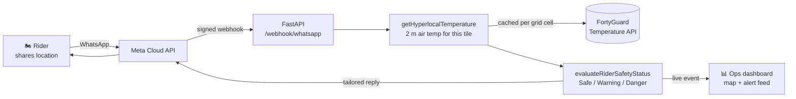

# 🌡️ Safety Rider

**Heat-exposure intelligence for people who ride for a living — delivered over WhatsApp.**

A rider shares their location in WhatsApp. Seconds later they get a verdict for
exactly where they are: how hot it is, how long it stays that hot, and whether
they should keep riding. Dispatchers watch the whole fleet on a live map.

Built on the [FortyGuard Temperature API](https://fortyguard.com) for the 2026
FortyGuard hackathon.

---

## The problem

Delivery riders, couriers, and gig workers spend their shifts outdoors, on
schedules set by an app that has no idea how hot the street is. City-level
weather does not help them: it reports one number for a whole metro area, while
the difference between a shaded side street and the asphalt car park next to it
can be several degrees — and that difference is where heat illness happens.

Two things make a heat warning actually useful to a rider:

1. **It has to be about *their* block**, not their city.
2. **It has to reach them where they already are** — which is WhatsApp, not
   another app they will not install.

Safety Rider is both.

---

## How it works



The rider sends a pin. The service resolves the 2 m air temperature for that
specific tile, decides which safety band it falls in, and replies with the
actions that follow from it. Every evaluation also streams to a dashboard so a
dispatcher sees the fleet in real time.

### What the rider receives

> 🔴 **Dangerous heat — rest protocol active**
>
> Peak air temperature where you are: **41.5 °C** (107 °F).
> That spot spends about **10 hours** a day above the high-heat line.
>
> • **Stop riding now** and get into shade or air conditioning.
> • Rest 15 minutes minimum before moving again. Drink throughout.
> • Watch for heat stroke: confusion, dry skin, no sweating, nausea. If any of those appear, call emergency services.
> • Tell your dispatcher or a friend where you are.

### Asking for a cooler route

Reply with a destination and the service compares candidate paths by
**cumulative heat exposure** rather than distance:

> 🧭 **Cooler route found**
>
> Direct: 8.0 km, 30 min, peak 44.2 °C
> Cooler: 11.0 km, 40 min, peak 30.2 °C
>
> About 10 min longer, but roughly **6.0 fewer °C-hours** of high heat.

Routes are scored in **degree-hours above the high-heat line** — the area under
the curve, not the peak. A route touching 41 °C for thirty seconds is safer than
one sitting at 37 °C for twenty minutes, and only cumulative exposure sees that.
A detour more than 1.6× the fastest duration is never offered, however cool.

---

## Safety bands

| Band | Range | Response |
|---|---|---|
| 🟢 **Safe** | under 35 °C | Ride normally. No message clutter. |
| 🟡 **Warning** | 35 – 40 °C | Hydration protocol, shade breaks, timing advice. |
| 🔴 **Danger** | 40 °C and above | Automated rest protocol, and an offer to find a cooler route. |

Bands are half-open (`35.0 ≤ t < 40.0`), so they partition the line with no gap
— a rider at 39.6 °C lands in Warning rather than falling through to Safe. A
test sweeps 0–60 °C in 0.1 °C steps and asserts every value lands in a real band.

Sustained exposure can promote Safe → Warning (≥ 4 hours above the OSHA
high-heat line), because four hours at 33 °C is a harder day than twenty minutes
at 34 °C and a peak-only reading cannot tell the difference. It never
manufactures Danger — that stays anchored to 40 °C.

---

## What we measured

Three findings from live API data that shaped the design. Each one would have
produced a dangerously wrong answer if handled naively.

### 1. "Today" is a trap

The catalog covers 2021 → today, but *today* means **only the hours that have
already elapsed**. Measured on 2026-08-20:

| Query | Peak | Hours above threshold |
|---|---|---|
| Today, mid-morning | 18.8 °C | **0.0** on all 9,968 tiles |
| A complete August day, same place | 36–37 °C | 10+ |

A rider checking at 08:00 would be told **"🟢 Clear to ride"** on a day that goes
on to hit 36 °C. Safety Rider therefore measures the **last complete day** and
names that date in every reply.

"Complete" has to be checked, not assumed. Ingestion lags the calendar, and a
day that is still arriving does not return an error — it returns one hour's
snapshot in which every tile reads the same number:

| Day requested (on 2026-08-23) | min / mean / peak | Verdict |
|---|---|---|
| 2026-08-22 (yesterday) | 15.89 / 15.89 / **15.89** | partial — flat across all 9,968 tiles |
| 2026-08-21 | 15.87 / 19.25 / **25.52** | complete |
| 2026-08-16 | 16.07 / 20.70 / **30.10** | complete |

A collapsed min == mean == max is the only signal that the day is unfinished, so
the service tests for it and walks back a day at a time until a real diurnal
range appears.

### 2. The heat index peaks at 4 a.m.

`env_params` applies a single temperature anchor across all 24 hours and varies
only humidity, so `heat_index_celsius` tracks humidity and peaks overnight — it
is a humidity-sensitivity curve, not a forecast. On live 2026-08-19 data:

| Reading | Value |
|---|---|
| Naive maximum | **74.5 °C at 04:00** — 166 °F, off the end of the NWS table |
| At the actual hot hour (14:00) | **39.9 °C** |
| Error avoided | **34.6 °C** |

So we locate the hour where *apparent* temperature peaks — which does follow the
real diurnal cycle — and read the heat index only there.

### 3. Duration discriminates; peak does not

Below city scale the temperature snapshot is nearly flat (~0.9 °C across a
1.2 km² area) while **exceedance** — hours spent above a threshold — spreads
15+ hours over the same ground. Duration is what separates two points a few
blocks apart, so it drives the advice.

---

## The dashboard

`http://localhost:8000/dashboard`

- **Live map** (Leaflet) with a marker per rider — green Safe, orange Warning,
  **blinking red Danger**, auto-panning to anyone entering Danger.
- **Streaming alert feed** over Server-Sent Events.
- **⚡ Simulate Heat Spike** — forces a rider into a high-heat zone through the
  *real* pipeline (same banding engine, same reply text, same WhatsApp call) so
  the demo is reproducible.

Phone numbers are masked by default (`+14155****123`) because the dashboard is
built to be screen-shared.

---

## Setup

### Requirements

Python 3.10+, a [FortyGuard API key](https://fortyguard.com), and a Meta
WhatsApp Cloud API app.

### Install

```bash
git clone https://github.com/NailaYaqoob/safety-rider.git
cd safety-rider
python -m venv venv && source venv/bin/activate   # Windows: venv\Scripts\activate
pip install -r requirements-service.txt
```

### Configure

```bash
cp .env.example .env    # then fill it in
```

Minimum to boot:

| Variable | What it is |
|---|---|
| `FORTYGUARD_API_KEY` | Your FortyGuard key |
| `WHATSAPP_VERIFY_TOKEN` | A random string you invent; paste the same one into Meta |
| `WHATSAPP_APP_SECRET` | App Dashboard → Settings → Basic |
| `WHATSAPP_ACCESS_TOKEN` | System User token (the 24-hour one expires overnight) |
| `WHATSAPP_PHONE_NUMBER_ID` | WhatsApp Manager → API Setup (the **ID**, not the number) |

`.env.example` documents every option with the reasoning behind its default.

### Run

```bash
uvicorn safety_rider.app:app --port 8000
```

Then open http://localhost:8000/dashboard.

**Demo mode** — no API key, no credits, no network:

```bash
SAFETY_RIDER_MOCK_TEMPERATURE=1 SAFETY_RIDER_MOCK_TEMP_C=41.5 \
    uvicorn safety_rider.app:app --port 8000
```

The simulator is deterministic (hashed from grid cell + date), so the same pin
gives the same answer every time — a demo you can rehearse. Simulated readings
are always labelled `SIMULATED` in the reply so they cannot be mistaken for
measurements.

### Deploy

```bash
# Railway reads railway.toml and builds from the Dockerfile.
# Set your env vars, generate a domain, done.
```

Full walkthrough — including why this service cannot run on Vercel — in
[DEPLOY.md](DEPLOY.md).

### Connect WhatsApp

Meta only calls **public HTTPS**, so expose the port:

```bash
cloudflared tunnel --url http://localhost:8000 --protocol http2
```

In the Meta App Dashboard → WhatsApp → Configuration:

1. **Callback URL:** `https://<your-tunnel>/webhook/whatsapp`
2. **Verify token:** your `WHATSAPP_VERIFY_TOKEN`
3. Save — then **subscribe to the `messages` field**. This is a separate step,
   and missing it is the classic failure: verification goes green and no message
   ever arrives.

---

## Architecture

```
safety_rider/
├── temperature_service.py   getHyperlocalTemperature — point in, 2 m air temp out.
│                            Never raises; failure returns as data.
├── rider_status.py          evaluateRiderSafetyStatus — the bands and protocols.
├── heat_layer.py            AOI construction, per-(cell, date) caching, tile lookup.
├── heat_risk.py             NOAA/OSHA-threshold engine + heat-index correction.
├── routing.py               Candidate routes from OSRM, scored by heat exposure.
├── events.py                Fan-out hub and rider registry for the dashboard.
├── config.py                Every setting, with the reasoning for each default.
├── whatsapp/
│   ├── webhook.py           GET verification, HMAC signature check, dedup, controller.
│   ├── parser.py            Meta's envelope → typed messages.
│   └── graph_client.py      Outbound replies.
└── dashboard/               Map, SSE feed, demo simulator.
```

**Two banding engines, deliberately.** `rider_status` is the operational
protocol — coarse, decisive, what the rider sees. `heat_risk` bands against
published NOAA/OSHA thresholds and is what you cite when someone asks why a
warning fired. They answer different questions and are kept separate.

### Cost control

A heatmap is billed **per request** and covers an **area**, not a point. Rider
locations snap to a ~5.5 km grid and one set of layers is cached per
(cell, date), so every rider in that cell after the first is answered from disk
with no API traffic.

---

## Tests

```bash
python tests/test_whatsapp_webhook.py   # 31 checks
python tests/test_heat_risk_live.py     # 28 checks
python tests/test_rider_status.py       # 79 checks
python tests/test_dashboard.py          # 44 checks
python tests/test_routing.py            # 31 checks
```

**213 checks**, no pytest required, all exit non-zero on failure.

Every suite is **offline by construction, not by convention**: the FortyGuard
base URL points at an unroutable address, a `FakeClient` raises if the code
tries to bill a heatmap it should have served from cache, and outbound Graph
calls are captured rather than sent. See [tests/README.md](tests/README.md).

---

## Limits

Stated plainly, because a safety tool that overstates itself is worse than none.

- **United States only.** The FortyGuard API's coverage. Locations outside it
  get a clear "outside coverage" reply rather than a guess.
- **Last complete day, not a forecast.** See [finding 1](#1-today-is-a-trap).
  The reply always names the date its figures come from.
- **Route comparison depends on the public OSRM demo server**, which is
  rate-limited, has no uptime guarantee, and returns no alternatives — so
  candidates are generated here by routing via offset waypoints. Run your own
  OSRM instance before anyone depends on this.
- **Single process.** The event hub and the message-dedup cache are both
  in-memory. Running more than one worker silently splits riders between them;
  both need Redis before scaling out.
- **Resolution is 60/80/100 m**, not 10 m — the API's tile sizes.

---

## Licence and ownership

This repository contains two layers with different owners:

- **`safety_rider/`, `tests/`** — original work, © 2026 Naila Yaqoob.
- **`fortyguard/`, `notebooks/`, `data/`** — FortyGuard's
  [temperature-api-quickstart](https://github.com/FortyGuard-Tech/temperature-api-quickstart),
  MIT licensed, © 2026 FortyGuard, Inc., used unmodified. Their original
  quickstart documentation is preserved at
  [docs/fortyguard-quickstart.md](docs/fortyguard-quickstart.md).

Ownership of Safety Rider is retained by the author; FortyGuard, Inc. holds a
non-exclusive licence to showcase it. Full terms in [NOTICE.md](NOTICE.md);
credits in [CONTRIBUTORS.md](CONTRIBUTORS.md).

---

<div align="center">

**Safety Rider** — built by [Naila Yaqoob](https://github.com/NailaYaqoob)
on the FortyGuard Temperature API.

</div>
