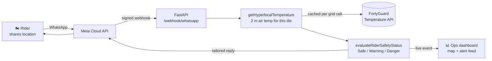

# 🌡️ Safety Rider

**Street-level heat protection for last-mile fleets — to the rider over WhatsApp,
to dispatch over a live map.**

A rider shares their location in WhatsApp. Seconds later they get a verdict for
exactly where they are: how hot it is, how long it stays that hot, and whether
they should keep riding. Dispatch watches the whole fleet on a live map and sees
each threshold crossing as it fires.

Built on the [FortyGuard Temperature API](https://fortyguard.com) for
**FortyGuard Hackathon'26 — Track 3, Industrial & Enterprise**: a logistics
route-and-temperature tool that protects worker safety on last-mile routes.

---

## Who buys this, and why

**The customer is the fleet, not the rider.** A last-mile operator — courier
network, grocery delivery, field-service dispatch — is the party carrying the
exposure when heat lands on a shift, and the party with a budget line for it.

| What heat costs the operator | What Safety Rider does about it |
|---|---|
| Heat-illness incidents, and the workers'-comp claims behind them | The rider is warned at *their* block before the shift becomes an incident |
| Heat enforcement, which opens on the employer, not the worker | Every verdict is anchored to a published threshold — OSHA high-heat 32.2 °C, NOAA Danger 39.4 °C — and names the date it measured |
| Riders stopping mid-shift with no warning | Dispatch sees the Danger event when it fires, not when the drop is late |
| Blanket "too hot to ride" calls across a whole metro | Per-tile verdicts stand down the blocks that are actually fine |

The rider gets safety. The operator gets a decision it can defend. That is who
signs the contract.

### The problem underneath

Riders spend their shifts outdoors on schedules set by software that has no idea
how hot the street is. City-level weather cannot fix that: it reports one number
for a whole metro, while the gap between a shaded side street and the asphalt lot
beside it runs several degrees — and that gap is where heat illness happens. A
metro-wide advisory is simultaneously too alarming for half a city and not
alarming enough for the other half.

Two things make a heat warning useful in an operation:

1. **It has to be about *their* block**, not their city.
2. **It has to reach them where they already are** — WhatsApp, not another app
   nobody installs.

Safety Rider is both.

---

## How it works



The rider sends a pin. The service resolves the 2 m air temperature for that
specific tile, decides which safety band it falls in, and replies with the
actions that follow from it. Every evaluation also streams to a dashboard so a
dispatcher sees the fleet in real time.

### What the rider receives

> 🔴 **Dangerous heat — rest protocol active**
>
> Right now where you are: **41.5 °C** (107 °F).
> That spot spends about **10 hours** a day above the high-heat line (measured 21 Aug).
>
> • **Stop riding now** and get into shade or air conditioning.
> • Rest 15 minutes minimum before moving again. Drink throughout.
> • Watch for heat stroke: confusion, dry skin, no sweating, nausea. If any of those appear, call emergency services.
> • Tell your dispatcher or a friend where you are.

### Routing the shift around the heat

This is the part a fleet buys twice: it protects the rider *and* it keeps the
drop on time, because the alternative to a cooler route is a stopped rider.

Reply with a destination and the service compares candidate paths by
**cumulative heat exposure** rather than distance:

> 🧭 **Cooler route found**
>
> Direct: 8.0 km, 30 min, peak 44.2 °C
> Cooler: 11.0 km, 40 min, peak 30.2 °C
>
> About 10 min longer, but roughly **6.0 fewer °C-hours** of high heat.

Routes are scored in **degree-hours above the high-heat line** — the area under
the curve, not the peak. A route touching 41 °C for thirty seconds is safer than
one sitting at 37 °C for twenty minutes, and only cumulative exposure sees that.
A detour more than 1.6× the fastest duration is never offered, however cool —
an operator will not trade a delivery window for a temperature it cannot feel.

The public OSRM demo server returns no alternatives even when asked, so
candidates are generated here by routing *via* waypoints offset perpendicular to
the direct line. Measured on a real Phoenix corridor (Downtown → Papago Park),
that yields four genuinely distinct paths:

| Candidate | Distance | Duration | Route points | Heat cells priced |
|---|---|---|---|---|
| Direct | 19.10 km | 20.0 min | 565 | 4 |
| Detour 1 | 19.48 km | 23.0 min | 681 | 4 |
| Detour 2 | 20.37 km | 23.9 min | 669 | 4 |
| Detour 3 | 24.15 km | 29.4 min | 812 | 4 |

Note the last column. Heat is billed per area, so 812 route vertices are
deduplicated to the handful of grid cells the route actually crosses, and
`max_route_cells` caps even that — a cross-country request cannot quietly spend
a fortune.

**On heat-sensitive cargo.** The scoring engine is threshold-parameterised, not
hard-wired to human physiology: `exceedance` takes the threshold as an argument,
so the same degree-hours machinery scores a 2–8 °C pharmaceutical cold chain or a
25 °C chocolate limit by changing one number. The product does not yet expose
that — today every threshold is the worker-safety one. It is the nearest
adjacent product, not a shipped feature.

---

## Safety bands

| Band | Range | Response |
|---|---|---|
| 🟢 **Safe** | under 35 °C | Ride normally. No message clutter. |
| 🟡 **Warning** | 35 – 40 °C | Hydration protocol, shade breaks, timing advice. |
| 🔴 **Danger** | 40 °C and above | Automated rest protocol, dispatcher escalation, and a cooler route offered unasked. |

Bands are half-open (`35.0 ≤ t < 40.0`), so they partition the line with no gap
— a rider at 39.6 °C lands in Warning rather than falling through to Safe. A
test sweeps 0–60 °C in 0.1 °C steps and asserts every value lands in a real band.

Sustained exposure can promote Safe → Warning (≥ 4 hours above the OSHA
high-heat line), because four hours at 33 °C is a harder day than twenty minutes
at 34 °C and a peak-only reading cannot tell the difference. It never
manufactures Danger — that stays anchored to 40 °C.

### What Danger actually triggers

The rest protocol is not just a differently-worded reply. Crossing 40 °C fires
three things beyond the rider's own message:

- **The dispatcher is told**, on WhatsApp, with the rider's masked number,
  coordinates, temperature, the threshold crossed, and a map link. A fleet buys
  this so somebody with authority hears about a stopped rider when it happens,
  not when the drop runs late. Set `SAFETY_RIDER_DISPATCHER_NUMBER`.
- **A cooler route is offered without being asked for**, when the rider has
  said where they were going in the last two hours. Making someone who has just
  been told to stop riding type out coordinates is the moment they close
  WhatsApp. It stays silent when there is no destination on file, when the
  stored one is stale, or when no route is meaningfully cooler — a Danger
  message is already long, and burying "stop riding now" under "I could not
  find a better route" would be worse than saying nothing.
- **The console shows both**, with the automatic route drawn on the map like
  any other comparison.

The automatic re-route spends the same route budget a rider would have spent by
asking, so a rider repeatedly re-entering Danger cannot run up billed cells by
standing still.

**Every verdict names the published threshold it crossed.** The bands above are
ours; the line underneath them is NOAA's and OSHA's, and both the rider's
message and the dispatcher's feed print it:

> _Threshold: NOAA Danger, ≥ 39.4 °C (103 °F)._

That is the sentence an operator repeats when a stopped shift is questioned —
by the rider who thinks it was over-cautious, by the manager who paid for it, or
by an inspector afterwards. "It felt hot" is not defensible; a published onset
temperature is.

---

## What we measured

Three findings from live API data that shaped the design. Each one would have
produced a dangerously wrong answer if handled naively.

### 1. "Today" is a trap

The catalog covers 2021 → today, but *today* means **only the hours that have
already elapsed**. Measured on 2026-08-20:

| Query | Peak | Hours above threshold |
|---|---|---|
| Today, mid-morning | 18.8 °C | **0.0** on all 9,968 tiles |
| A complete August day, same place | 36–37 °C | 10+ |

A rider checking at 08:00 would be told **"🟢 Clear to ride"** on a day that goes
on to hit 36 °C. Safety Rider therefore measures the **last complete day** and
names that date in every reply.

"Complete" has to be checked, not assumed. Ingestion lags the calendar, and a
day that is still arriving does not return an error — it returns one hour's
snapshot in which every tile reads the same number:

| Day requested (on 2026-08-23) | min / mean / peak | Verdict |
|---|---|---|
| 2026-08-22 (yesterday) | 15.89 / 15.89 / **15.89** | partial — flat across all 9,968 tiles |
| 2026-08-21 | 15.87 / 19.25 / **25.52** | complete |
| 2026-08-16 | 16.07 / 20.70 / **30.10** | complete |

A collapsed min == mean == max is the only signal that the day is unfinished, so
the service tests for it and walks back a day at a time until a real diurnal
range appears.

**The way through the trap is to stop asking for days.** `filter_type=1` asks
for a single elapsed hour, and that *does* return today. Measured 2026-08-24 at
12:47 UTC over a 1 km AOI:

| Query | Result |
|---|---|
| Today 12:00 (the hour in progress) | **360 tiles**, 28.73 / 30.11 / 30.93 °C |
| Today 18:00 (six hours ahead) | `{"features": []}`, `n_cells: 0`, no error |

So the current hour is readable and the future is not — and the future fails
*silently*, as an empty layer rather than an error. Safety Rider therefore reads
**both**: the current hour decides the band, and the last complete day supplies
the duration figure that finding 3 shows is the discriminating metric. Every
reply names both timestamps, because they are not the same day.

One trap inside the fix: a single-hour layer has min == mean == max **by
construction**, which is the exact shape the partial-day check above rejects.
Applying that check to the hourly path would discard every valid nowcast. The
two paths are deliberately separate, and a test asserts a flat hourly tile is
accepted while a flat daily tile is not.

### 2. The heat index peaks at 4 a.m.

`env_params` applies a single temperature anchor across all 24 hours and varies
only humidity, so `heat_index_celsius` tracks humidity and peaks overnight — it
is a humidity-sensitivity curve, not a forecast. On live 2026-08-19 data:

| Reading | Value |
|---|---|
| Naive maximum | **74.5 °C at 04:00** — 166 °F, off the end of the NWS table |
| At the actual hot hour (14:00) | **39.9 °C** |
| Error avoided | **34.6 °C** |

So we locate the hour where *apparent* temperature peaks — which does follow the
real diurnal cycle — and read the heat index only there.

### 3. Duration discriminates; peak does not

Below city scale the temperature snapshot is nearly flat (~0.9 °C across a
1.2 km² area) while **exceedance** — hours spent above a threshold — spreads
15+ hours over the same ground. Duration is what separates two points a few
blocks apart, so it drives the advice.

---

## The dispatch console

`http://localhost:8000/dashboard`

The operator-facing half of the product: one screen a dispatcher can leave open
for a shift.

- **The heat layer itself, drawn on the map** — the same FortyGuard tiles the
  banding engine reads, coloured cool-to-hot under the riders standing on them.
  This is what makes "per-tile verdicts, not a city average" something you can
  see rather than something the pitch asserts. Served **cache-only**, so an
  open browser tab can never spend credits, and a partial day is refused for
  the overlay exactly as it is for a verdict — drawing an un-ingested day would
  paint one hour's noise as a day's heat gradient, in colour, on the screen a
  dispatcher trusts.
- **Live map** (Leaflet) with a marker per rider — green Safe, orange Warning,
  **blinking red Danger**, auto-panning to anyone entering Danger, and framing
  itself on wherever the fleet actually is.
- **Route comparison drawn on the map** — when a rider asks for a route, both
  candidates appear: the direct one dashed in red, the cooler one solid in
  blue, each clickable for its distance, duration, peak and °C·h exposure. A
  dispatcher can judge the detour instead of reading that one was offered. If a
  route leaves FortyGuard's coverage the line says so rather than passing a
  partially-blind score off as a full one.
- **Peak-temperature trend** — the last 24 readings plotted against the OSHA
  high-heat and NOAA Danger lines, so a dispatcher sees a shift heating up
  rather than only the moment it crosses.
- **Streaming alert feed** over Server-Sent Events.
- **⚡ Simulate Heat Spike** — forces a rider into a high-heat zone through the
  *real* pipeline (same banding engine, same reply text, same WhatsApp call) so
  the demo is reproducible.

Phone numbers are masked by default (`+14155****123`) because the dashboard is
built to be screen-shared.

---

## Setup

### Requirements

Python 3.10+, a [FortyGuard API key](https://fortyguard.com), and a Meta
WhatsApp Cloud API app.

### Install

```bash
git clone https://github.com/NailaYaqoob/safety-rider.git
cd safety-rider
python -m venv venv && source venv/bin/activate   # Windows: venv\Scripts\activate
pip install -r requirements-service.txt
```

### Configure

```bash
cp .env.example .env    # then fill it in
```

Minimum to boot:

| Variable | What it is |
|---|---|
| `FORTYGUARD_API_KEY` | Your FortyGuard key |
| `WHATSAPP_VERIFY_TOKEN` | A random string you invent; paste the same one into Meta |
| `WHATSAPP_APP_SECRET` | App Dashboard → Settings → Basic |
| `WHATSAPP_ACCESS_TOKEN` | System User token (the 24-hour one expires overnight) |
| `WHATSAPP_PHONE_NUMBER_ID` | WhatsApp Manager → API Setup (the **ID**, not the number) |

`.env.example` documents every option with the reasoning behind its default.

### Run

```bash
uvicorn safety_rider.app:app --port 8000
```

Then open http://localhost:8000/dashboard.

**Demo mode** — no API key, no credits, no network:

```bash
SAFETY_RIDER_MOCK_TEMPERATURE=1 SAFETY_RIDER_MOCK_TEMP_C=41.5 \
    uvicorn safety_rider.app:app --port 8000
```

The simulator is deterministic (hashed from grid cell + date), so the same pin
gives the same answer every time — a demo you can rehearse. Simulated readings
are always labelled `SIMULATED` in the reply so they cannot be mistaken for
measurements.

### Deploy

```bash
# Railway reads railway.toml and builds from the Dockerfile.
# Set your env vars, generate a domain, done.
```

Full walkthrough — including why this service cannot run on Vercel — in
[DEPLOY.md](DEPLOY.md).

### Connect WhatsApp

Meta only calls **public HTTPS**, so expose the port:

```bash
cloudflared tunnel --url http://localhost:8000 --protocol http2
```

In the Meta App Dashboard → WhatsApp → Configuration:

1. **Callback URL:** `https://<your-tunnel>/webhook/whatsapp`
2. **Verify token:** your `WHATSAPP_VERIFY_TOKEN`
3. Save — then **subscribe to the `messages` field**. This is a separate step,
   and missing it is the classic failure: verification goes green and no message
   ever arrives.

---

## Architecture

```
safety_rider/
├── temperature_service.py   getHyperlocalTemperature — point in, 2 m air temp out.
│                            Never raises; failure returns as data.
├── rider_status.py          evaluateRiderSafetyStatus — the bands and protocols.
├── heat_layer.py            AOI construction, per-(cell, date) caching, tile lookup.
├── heat_risk.py             NOAA/OSHA thresholds, heat-index correction, and the
│                            citation printed under every verdict.
├── routing.py               Candidate routes from OSRM, scored by heat exposure.
├── warm.py                  Pre-fetches hourly layers out of band, on an
│                            in-process hourly schedule (see Cost control).
├── rate_limit.py            Per-rider budgets on messages and route requests.
├── events.py                Fan-out hub and rider registry for the dashboard.
├── config.py                Every setting, with the reasoning for each default.
├── whatsapp/
│   ├── webhook.py           GET verification, HMAC signature check, dedup, controller.
│   ├── parser.py            Meta's envelope → typed messages.
│   └── graph_client.py      Outbound replies.
└── dashboard/               Map, SSE feed, demo simulator.
```

**Two banding engines, deliberately.** `rider_status` is the operational
protocol — coarse, decisive, what the rider sees. `heat_risk` holds the
published NOAA/OSHA thresholds and is what you cite when someone asks why a
warning fired. They answer different questions and are kept separate, but they
are not independent: every verdict `rider_status` produces carries the
`heat_risk` citation for the line it crossed, so the decisive answer and the
defensible one always travel together.

### Cost control

A heatmap is billed **per request** and covers an **area**, not a point. Rider
locations snap to a ~5.5 km grid and one set of layers is cached per
(cell, date), so every rider in that cell after the first is answered from disk
with no API traffic.

**The nowcast is never fetched on the rider's message.** These endpoints are
submit-then-poll and slow — measured 2026-08-24, an hourly layer took **219 s
for 380 tiles and 256 s for 9,968**. That is queue latency, not tile count, so
a smaller AOI buys nothing and no size fits inside a WhatsApp reply. Worse, a
client-side timeout abandons the poll but *not* the billed job, so an on-demand
retry pays repeatedly for answers nobody reads.

So the rider path reads the hourly layer **cache-only**: warm, and the reply
carries a nowcast; cold, and the daily reading answers. A test asserts a rider
message can never submit an hourly request. The spend moves out of band:

```bash
python -m safety_rider.warm 33.4484 -112.0740      # warm one Phoenix cell
```

Cost is then bounded by **service area, not traffic** — one request per active
cell per hour whether one rider pins there or fifty.

The schedule is built in: name your service area in `SAFETY_RIDER_WARM_CELLS`
and the service warms those cells hourly, starting at boot. It runs **inside
the service process** rather than as a cron container or a CI job, and that is
not incidental — a warmed layer is a file in the heat cache directory and the
rider path reads that same directory, so an external runner would warm its own
filesystem and the service would never see it. Anything warming this cache has
to share the volume with the process reading it.

Empty by default, because every pass spends credits. `SAFETY_RIDER_NOWCAST=0`
ignores the hourly layer entirely.

**Each rider also has a budget.** Meta authenticates the *sender* of a webhook,
not the rider inside it, so a valid signature says nothing about whether one
number is pinning once an hour or once a second — and nothing else upstream
bounds it. Riders get 12 messages per 5 minutes, and routing gets its own
tighter budget of 4 per 15 minutes because a comparison prices several cells
where a pin usually prices one.

Three details matter more than the numbers:

- **A throttled rider is told once, then not again.** Replying to every
  throttled message would turn the limiter into a 1:1 amplifier — exactly the
  spend it exists to stop.
- **A refused route hands its general budget back**, so over-using route
  comparison can never cost a rider the plain "is it safe here?" check. That is
  the one path a cost control must not be able to close.
- **The dispatcher sees it.** A rider suddenly hammering the service is as
  likely to be someone in trouble tapping *send* as it is abuse, so the
  throttle raises a console event rather than only a log line.

---

## Tests

```bash
python tests/test_whatsapp_webhook.py   #  30 checks
python tests/test_heat_risk_live.py     #  27 checks
python tests/test_rider_status.py       # 113 checks
python tests/test_dashboard.py          #  81 checks
python tests/test_routing.py            #  48 checks
python tests/test_rate_limit.py         #  45 checks
python tests/test_warm.py               #  30 checks
python tests/test_escalation.py         #  30 checks
```

**404 checks**, no pytest required, all exit non-zero on failure. CI runs every
suite on push — [.github/workflows/tests.yml](.github/workflows/tests.yml).

Every suite is **offline by construction, not by convention**: the FortyGuard
base URL points at an unroutable address, a `FakeClient` raises if the code
tries to bill a heatmap it should have served from cache, and outbound Graph
calls are captured rather than sent. See [tests/README.md](tests/README.md).

---

## Limits

Stated plainly, because a safety tool that overstates itself is worse than none.

- **United States only.** The FortyGuard API's coverage. Locations outside it
  get a clear "outside coverage" reply rather than a guess.
- **A nowcast, never a forecast.** The current hour is real; six hours ahead
  returns an empty layer (see [finding 1](#1-today-is-a-trap)). Nothing here
  predicts. Duration still comes from the last complete day, and the reply names
  both timestamps rather than blurring them into one.
- **Route comparison depends on the public OSRM demo server**, which is
  rate-limited, has no uptime guarantee, and returns no alternatives — so
  candidates are generated here by routing via offset waypoints. Run your own
  OSRM instance before anyone depends on this.
- **Single process.** The event hub, the message-dedup cache and the rate-limit
  windows are all in-memory. Running more than one worker silently splits
  riders between them: a rider handled by worker B never appears on a dashboard
  streaming from worker A, a Meta retry could be answered twice, and each rider
  gets one budget per worker. All three want Redis at the same time. The rider
  registry — the last known
  position a routing request is answered from — *is* persisted to disk and
  restored at startup, so a redeploy no longer tells a rider who pinned a
  minute ago that we have no idea where they are. Entries expire after 24
  hours, which is also the window past which WhatsApp will not let us send them
  a free-form reply anyway.
- **Resolution is 60/80/100 m**, not 10 m — the API's tile sizes.
- **No durable record yet.** The alert history is an in-memory ring of the last
  100 events and is lost on restart. Fleet customers will want a retained,
  exportable trail of who was warned and when — that is a database, and it is
  the first thing to build after the hackathon, not something claimed here.
- **The dispatch console is unauthenticated.** Anyone with the URL sees rider
  positions and the alert feed. Phone numbers are masked and the simulator is
  gated behind `SAFETY_RIDER_DEV_TOOLS`, but the page itself is open — keep the
  deployed URL private, and put real access control in front of it before a
  fleet customer's riders are on it.
- **Cargo thresholds are not exposed.** The engine generalises to them; the
  product does not offer them.

---

## Licence and ownership

This repository contains two layers with different owners:

- **`safety_rider/`, `tests/`** — original work, © 2026 Naila Yaqoob.
- **`fortyguard/`, `notebooks/`, `data/`** — FortyGuard's
  [temperature-api-quickstart](https://github.com/FortyGuard-Tech/temperature-api-quickstart),
  MIT licensed, © 2026 FortyGuard, Inc., used unmodified. Their original
  quickstart documentation is preserved at
  [docs/fortyguard-quickstart.md](docs/fortyguard-quickstart.md).

Ownership of Safety Rider is retained by the author; FortyGuard, Inc. holds a
non-exclusive licence to showcase it. Full terms in [NOTICE.md](NOTICE.md);
credits in [CONTRIBUTORS.md](CONTRIBUTORS.md).

---

<div align="center">

**Safety Rider** — built by [Naila Yaqoob](https://github.com/NailaYaqoob)
on the FortyGuard Temperature API.

</div>
